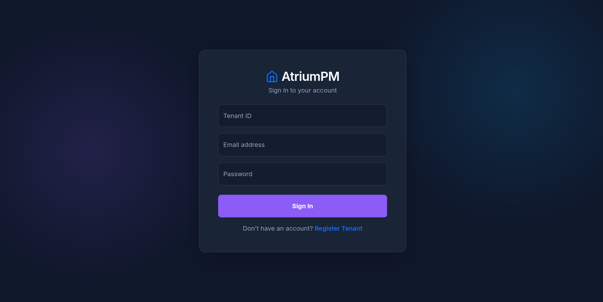
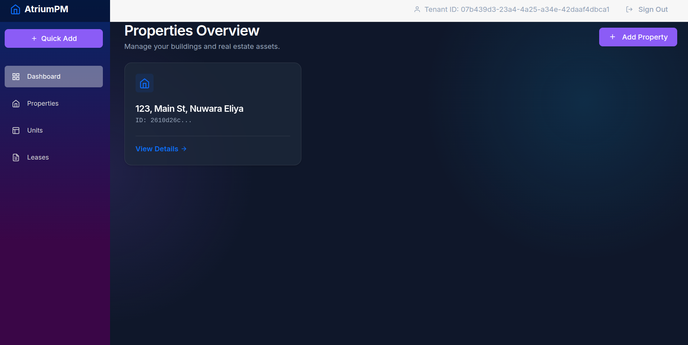
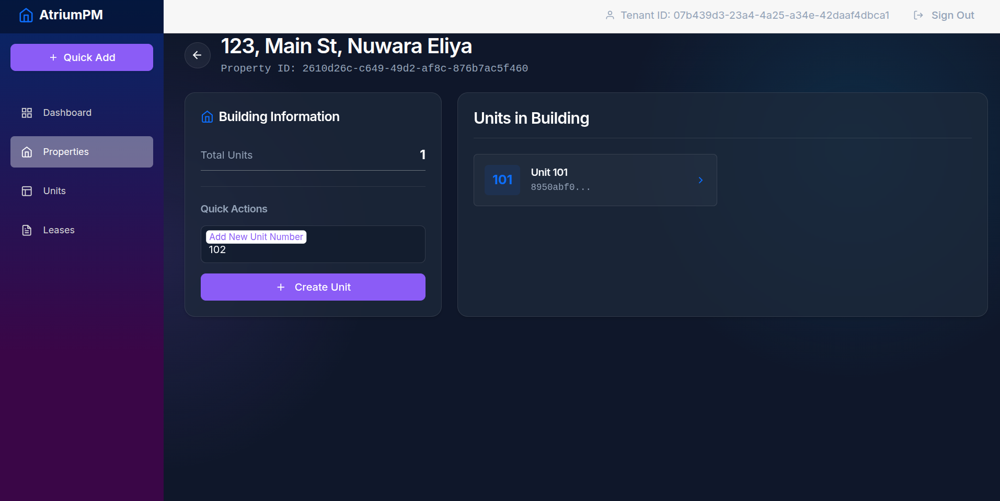
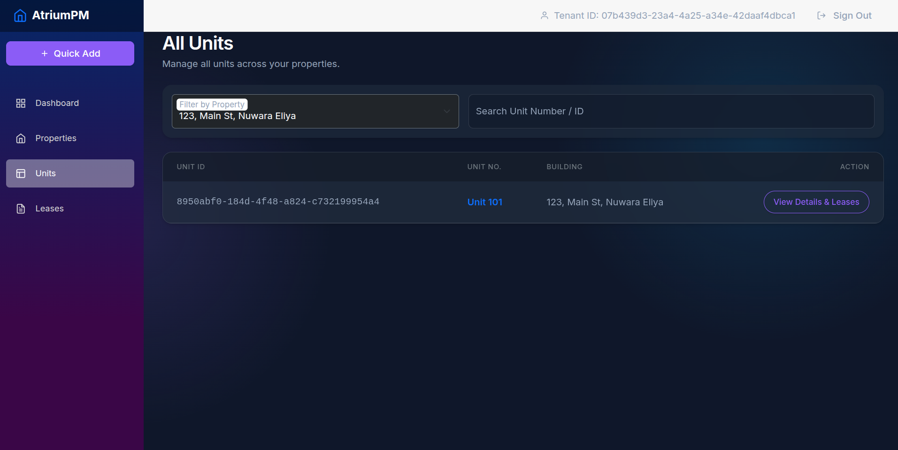
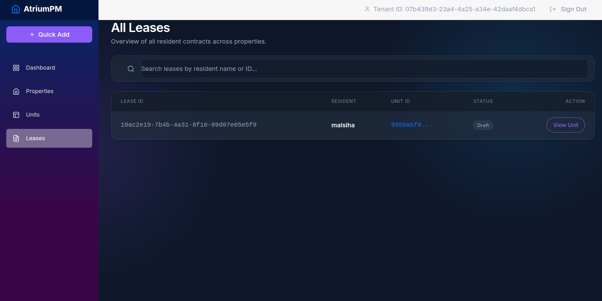

# AtriumPM - Property Management System

AtriumPM is a comprehensive, enterprise-grade property management application built using a modern microservices architecture with **.NET 10** and **Blazor Web**. It provides a robust platform for managing users, properties, units, leases, maintenance, and billing efficiently.

## ✨ Cool Features & Architecture Highlights

### 🏢 True Multi-Tenancy with Row-Level Security (RLS)
The application utilizes a highly secure database-level multi-tenancy model. Instead of filtering by `TenantId` in every LINQ query, it uses **SQL Server Row-Level Security (RLS)**.
- **`TenantSessionContextConnectionInterceptor`**: Automatically injects the current tenant's ID into the SQL Server session context (`sp_set_session_context`).
- **`TenantRlsBootstrapper`**: Dynamically creates SQL Server Security Policies to filter and block data access, ensuring strict data isolation per tenant at the database engine level.

### 📨 Event-Driven Architecture
Asynchronous communication between microservices is handled via **RabbitMQ** using **MassTransit**.
- Microservices are decoupled; for instance, the `Billing API` reacts to `LeaseSignedEvent`s published by the `Leasing API` to automatically generate invoices.

### ⏱️ Background Jobs
Uses **Quartz.NET** for robust background task scheduling, enabling critical time-based operations like recurring billing and late fee generation.

### 🚀 Modern Tech Stack
- **Frontend**: Blazor Web App for a rich, interactive user experience.
- **Caching**: **Redis** for distributed caching to ensure high performance.
- **Database**: **SQL Server 2022** with Entity Framework Core 10.
- **Authentication**: JWT-based authentication via a centralized Identity API.
- **Containerization**: Fully containerized using Docker and easily orchestratable via Docker Compose.

---

## 🏗 Microservices

- **Identity API**: Handles user authentication, authorization, and multi-tenancy scope using JWT.
- **Property API**: Manages properties, buildings, and individual units.
- **Leasing API**: Processes lease agreements, tenant information, and contracts.
- **Maintenance API**: Tracks maintenance requests and service updates.
- **Billing API**: Manages financial records, invoices, and payments.

## 🚀 Getting Started

You can run the entire application stack locally using Docker Compose. Make sure you have Docker installed on your machine.

From the root directory, execute:

```bash
docker-compose up -d --build
```

- The **Blazor Frontend** will be accessible at `http://localhost:5600`.
- The APIs run on ports `5100` to `5500`.

---

## 📸 Screenshots

login with multi tenancy


manage properties


view property information and create units


view units per property (filter by building or view all)


leases for residents

